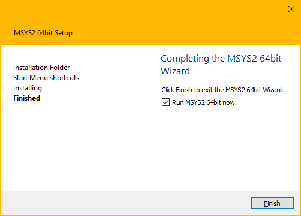

# Instalación en Linux

Linux ya lo trae por defecto, saludos.

# Instalación en Windows

Solo recomendable para usuarios avanzados que prefieren una terminal.

No recomendable para el caso contrario.

1. Descargar el instalador en: https://www.msys2.org/


2. Abrir el instalador. MSYS2 requiere "Windows 7 64 bit" o mas nuevo.

3. Dejar por default o elegir una **Carpeta de instalación** 

   

4. Cuando termine, seleccionar **Run MSYS2 now**.

   

5. Actualizar los paquetes y la base de datos, ejecutar, cuando termine apretar la tecla **Y** para confirmar la actualización.
    `pacman -Syu`:

   ```
   $ pacman -Syu
   :: Synchronizing package databases...
    mingw32                        805.0 KiB
    mingw32.sig                    438.0   B
    mingw64                        807.9 KiB
    mingw64.sig                    438.0   B
    msys                           289.3 KiB
    msys.sig                       438.0   B
   :: Starting core system upgrade...
   warning: terminate other MSYS2 programs before proceeding
   resolving dependencies...
   looking for conflicting packages...
   
   Packages (6) bash-5.1.004-1  filesystem-2021.01-1
                mintty-1~3.4.4-1  msys2-runtime-3.1.7-4
                pacman-5.2.2-9  pacman-mirrors-20201208-1
   
   Total Download Size:   11.05 MiB
   Total Installed Size:  53.92 MiB
   Net Upgrade Size:      -1.24 MiB
   
   :: Proceed with installation? [Y/n]
   :: Retrieving packages...
    bash-5.1.004-1-x86_64            2.3 MiB
    filesystem-2021.01-1-any        33.2 KiB
    mintty-1~3.4.4-1-x86_64        767.2 KiB
    msys2-runtime-3.1.7-4-x86_64     2.6 MiB
    pacman-mirrors-20201208-1-any    3.8 KiB
    pacman-5.2.2-9-x86_64            5.4 MiB
   (6/6) checking keys in keyring       100%
   (6/6) checking package integrity     100%
   (6/6) loading package files          100%
   (6/6) checking for file conflicts    100%
   (6/6) checking available disk space  100%
   :: Processing package changes...
   (1/6) upgrading bash                 100%
   (2/6) upgrading filesystem           100%
   (3/6) upgrading mintty               100%
   (4/6) upgrading msys2-runtime        100%
   (5/6) upgrading pacman-mirrors       100%
   (6/6) upgrading pacman               100%
   :: To complete this update all MSYS2 processes including this terminal will be closed. Confirm to proceed [Y/n]
   ```

6. Arrancar "**MSYS2 MSYS**" desde el menú de inicio con el logo de Windows que esta a la izquierda. 
   

7. **Actualizar el resto** de los paquetes con 
   `pacman -Su`:

   ```
   $ pacman -Su
   :: Starting core system upgrade...
    there is nothing to do
   :: Starting full system upgrade...
   resolving dependencies...
   looking for conflicting packages...
   
   Packages (20) base-2020.12-1  bsdtar-3.5.0-1
                 [... more packages listed ...]
   
   Total Download Size:   12.82 MiB
   Total Installed Size:  44.25 MiB
   Net Upgrade Size:       3.01 MiB
   
   :: Proceed with installation? [Y/n]
   [... downloading and installation continues ...]
   ```

8. **Ahora MSYS2 esta listo**, solo falta **instalar** algunas herramientas y **gcc de mingw-w64** para poder **compilar**, ejecutar 
   `pacman -S --needed base-devel mingw-w64-x86_64-toolchain`:

   ```
   $ pacman -S --needed base-devel mingw-w64-x86_64-toolchain
   warning: file-5.39-2 is up to date -- skipping
   [... more warnings ...]
   :: There are 48 members in group base-devel:
   :: Repository msys
      1) asciidoc  2) autoconf  3) autoconf2.13  4) autogen
      [... more packages listed ...]
   
   Enter a selection (default=all):
   :: There are 19 members in group mingw-w64-x86_64-toolchain:
   :: Repository mingw64
      1) mingw-w64-x86_64-binutils  2) mingw-w64-x86_64-crt-git
      [... more packages listed ...]
   
   Enter a selection (default=all):
   resolving dependencies...
   looking for conflicting packages...
   
   Packages (123) docbook-xml-4.5-2  docbook-xsl-1.79.2-1
                  [... more packages listed ...]
                  m4-1.4.18-2  make-4.3-1  man-db-2.9.3-1
                  mingw-w64-x86_64-binutils-2.35.1-3
                  mingw-w64-x86_64-crt-git-9.0.0.6090.ad98746a-1
                  mingw-w64-x86_64-gcc-10.2.0-6
                  mingw-w64-x86_64-gcc-ada-10.2.0-6
                  mingw-w64-x86_64-gcc-fortran-10.2.0-6
                  mingw-w64-x86_64-gcc-libgfortran-10.2.0-6
                  mingw-w64-x86_64-gcc-libs-10.2.0-6
                  mingw-w64-x86_64-gcc-objc-10.2.0-6
                  mingw-w64-x86_64-gdb-10.1-2
                  mingw-w64-x86_64-gdb-multiarch-10.1-2
                 [... more packages listed ...]
   
   Total Download Size:    196.15 MiB
   Total Installed Size:  1254.96 MiB
   
   :: Proceed with installation? [Y/n]
   [... downloading and installation continues ...]
   ```

9. Para empezar a usar **GCC de mingw-w64**, cierre esta terminal y ejecute "**MSYS MinGW 64-bit**" desde el menú de inicio. Ahora podes ejecutar `make` o `gcc` para compilar software en Windows. **A partir de ahora solo deberemos usar MSYS MinGW 64-bit, se preferencia dejen un acceso directo en el escritorio**.

10. **Entender el editor de texto**, yo tengo preferencia por **vim**, por la cantidad de horas que puede ahorrar, pero tiene una curva de aprendizaje muy alta. También pueden usar **nano** que ya viene instalado por defecto.

    
    Se escribe y borra como en cualquier editor de texto, como el block de notas, se guarda con **Control + O**, se cancela con **Control + C** y se sale con **Control + X**, pero como ya te habrás dado cuenta, nano viene con las instrucciones impresas abajo de todo donde **^ significa Control**.
    
11. **Configurar la shell**: la shell que vamos a usar es **bash** y para poder configurarla vamos a editar nuestro archivo de configuración **.bashrc** (si, el nombre comienza con un punto y tiene una razón; la mayoría de archivos de configuración empiezan con un punto y de denominan "**dotfiles**", archivos de punto.) con un editor de texto como **nano** o **vim** y agregamos a lo ultimo una lineal:

     ```shell
     #
     #   #
     #   # Remove any other occurence of this dir, skipping the top of the stack
     #   for ((cnt=1; cnt <= 10; cnt++)); do
     #     x2=$(dirs +${cnt} 2>/dev/null)
     #     [[ $? -ne 0 ]] && return 0
     #     [[ ${x2:0:1} == '~' ]] && x2="${HOME}${x2:1}"
     #     if [[ "${x2}" == "${the_new_dir}" ]]; then
     #       popd -n +$cnt 2>/dev/null 1>/dev/null
     #       cnt=cnt-1
     #     fi
     #   done
     #
     #   return 0
     # }
     #
     # alias cd=cd_func
     
     # Vamos a hacer un camino para conectar los archivos ejecutables a nuestra terminal
     # El "encaminamiento tiene este formato"
     
     # export PATH="Carpeta\Con\Archivos\ejecutables:$PATH"   # En español seria algo como "Exportar CAMINO='DIRECCION\$:CAMINO'"
     
     # Hacemos un camino a los archivos de los subsistemas
     export PATH="C:\msys64\mingw64\bin\:$PATH" # Entorno de 64bits
     export PATH="C:\msys64\usr\bin\:$PATH" # Entorno principal
     
     # High Level Assembly PATH # Esto es lo que yo personalmente voy a usar para aprender ensamblador
     export PATH="C:\hla\:$PATH"
     
     # Aca conecto la terminal a mis ejecutables personales, calculadoras, editores, monitores, etc.
     # export PATH="C:\tools\:$PATH"
     
     # Hasta podes conectar zoom, pero es poco practico y molesto, solo lo hago de demostración
     # export PATH="%APPDATA%\Zoom\bin:$PATH" # Para el usuario actual que estes usando
     # export PATH="C:\Users\TU-USUARIO\AppData\Roaming\Zoom\bin\:$PATH" # Para un usuario concreto
     
     
     ```


​    

Con esto ya esta terminado todo el entorno de programación.

Lea la [pagina de introducción](https://www.msys2.org/wiki/MSYS2-introduction/) para aprender cual ítem del **Menú de Inicio** usar y cuales paquetes instalar. Vea la [guía detallada de instalación de MSYS2](https://www.msys2.org/wiki/MSYS2-installation/) para solucionar problemas y detalles adicionales sobre como mantener actualizado MSYS2.


### Extra: Cambiar la carpeta de inicio HOME a la carpeta HOME nativa de Windows

1.  **Localizar** el archivo **nsswitch.conf** en la carpeta "/etc" del entorno de msys2. Para entrar directo de Windows esta en la carpeta "C:\msys64\etc".
2.  **Comentar** la variable "**db_home: cygwin desc**" con un **#** (numeral) y reescribirla como "**db_home: windows**". Si prefiere reemplácela completamente.


```
# Begin /etc/nsswitch.conf

passwd: files db
group: files db

db_enum: cache builtin

#db_home: cygwin desc
db_home: windows
db_shell: cygwin desc
db_gecos: cygwin desc

# End /etc/nsswitch.conf}}
```

3. **Mover o Copiar** los archivos de usuario de MSYS2 a los archivos de usuario de Windows, **para combinarlos**.


**Sobre la carpeta de usuario de Windows**


4. Abrir MSYS2 y curiosear a ver si ya se realizo el cambio, cualquier cosa me escriben.

# Tutorial de C

### Como usar los comandos:


Se edita archivos con:

**vim** nombre-del-archivo**.c**
o 
**nano** nombre-del-archivo**.c** 


Se compila archivos con:
**gcc** nombre-del-archivo**.c** -o nombre-del-ejecutable**.exe**

Existe una forma ya automatizada para compilar, esto busca automáticamente el archivo con el nombre terminado en .c y devuelve un archivo .exe


**make** *nombre-del-archivo-sin-.-formato*

Ej:

"make fulano" **make busca** un archivo que se llame fulano y termine en **.c**, se lo pasa al **compilador gcc** y te devuelve un .exe

Al .exe lo ejecutan desde la terminal con:


**./**nombre-del-ejecutable**.exe**


### Como introducirte al lenguaje C

1. Ver cualquier tutorial de lenguaje C, como imprimir un mensaje que diga "hello world" y cosas basicas

   A mi me gusto este de FreeCodeCamp.org, pero esta en ingles:

   Ignorar la primera parte del tutorial, donde se enseña a instalar otros entornos de programación.

   https://www.youtube.com/watch?v=KJgsSFOSQv0&t=544s


2. **Leer los manuales ofrecidos por la catedra**

